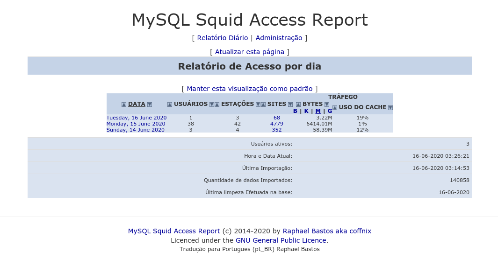

mysar-ng
========

MySQL Squid Access Report (new generation)

**MYSAR-ng Handbook**

**Requirements:**

<pre><code>PHP 7
Apache or Nginx
Mariadb 10.1 or higher
mariadb-devel
GCC</code></pre>

**Installation:**

**1- Install on APACHE:**

**1.1- Clone repository:**

<pre><code>cd /opt ; git clone https://github.com/coffnix/mysar-ng.git
mv /opt/mysar-ng/mysar /var/www/html/</code></pre>

**1.2- Copy file to apache conf dir:**

<pre><code>cp /var/www/html/mysar/etc/mysar.apache /etc/httpd/conf.d/mysar.conf</code></pre>

**or configure manually**

**(apache 2.2):**

<pre><code>Alias /mysar /var/www/html/mysar/www
<Directory "/var/www/html/mysar/www">
        Options Indexes MultiViews
        Options Indexes FollowSymLinks
        AllowOverride None
        Order allow,deny
        Allow from all
</Directory></code></pre>

**(apache 2.4):**

<pre><code>Alias /mysar /var/www/html/mysar/www
<Directory "/var/www/html/mysar/www">
        Options Indexes MultiViews
        Options Indexes FollowSymLinks
        AllowOverride None
        Require all granted
</Directory></code></pre>

**1.3- Restart apache:**

<pre><code>systemctl restart httpd</code></pre>

**2- Install on MYSQL:**

**2.1- Create user and database:**

<pre><code>mysql> create database mysar;
mysql> grant all privileges on mysar.* to mysar@'localhost' identified by 'mysar123';
mysql> flush privileges;</code></pre>

**2.2- Import default database:**

<pre><code>mysql mysar < /opt/mysar-ng/mysar.sql </code></pre>

**3- Compile Binary importer**

<pre><code>cd /var/www/html/mysar/bin/mysar-binary-importer/ ; make clean && make && make install</code></pre>

**4- Configure your crontab**

<pre><code>* * * * *      root    /usr/bin/mysar > /var/www/html/mysar/log/mysar-importer.log 2>&1
01 00 * * * root /var/www/html/mysar/bin/mysar-rotate-diario.sh</code></pre>

**Best practices**

**turn off logs cache_object on SQUID:**

<pre><code>acl manager proto cache_object
acl localhost src 127.0.0.1/32

log_access deny manager
http_access allow manager localhost</code></pre>

For more infos, please RTFM :D

Squid old: http://www.squid-cache.org/Doc/config/log_access/

Squid new: http://www.squid-cache.org/Doc/config/access_log/ 

