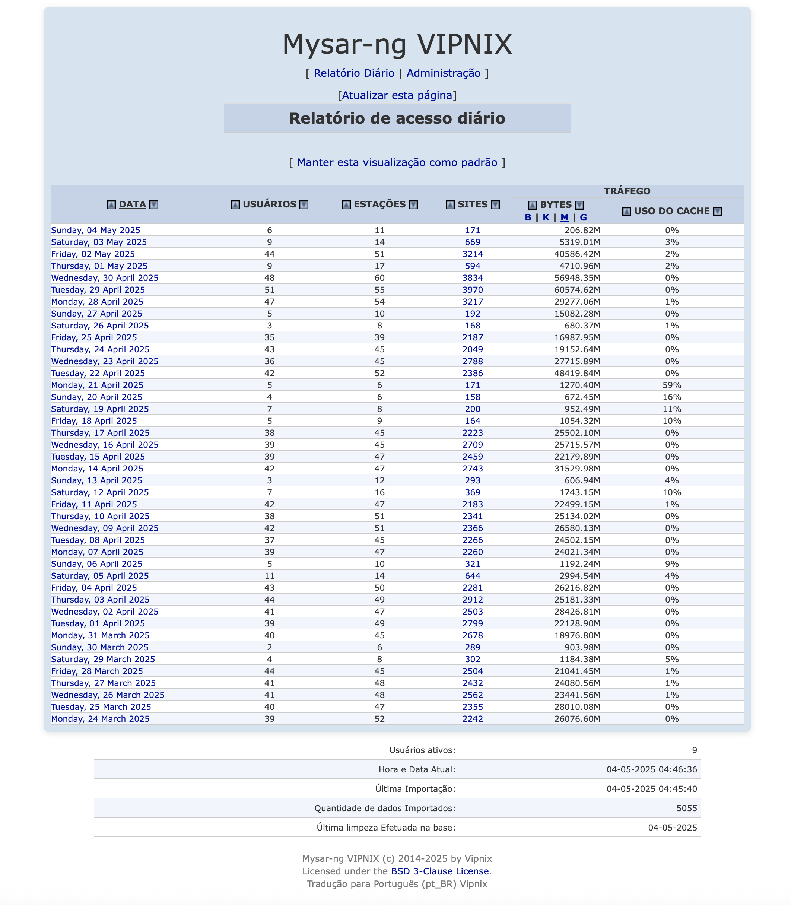
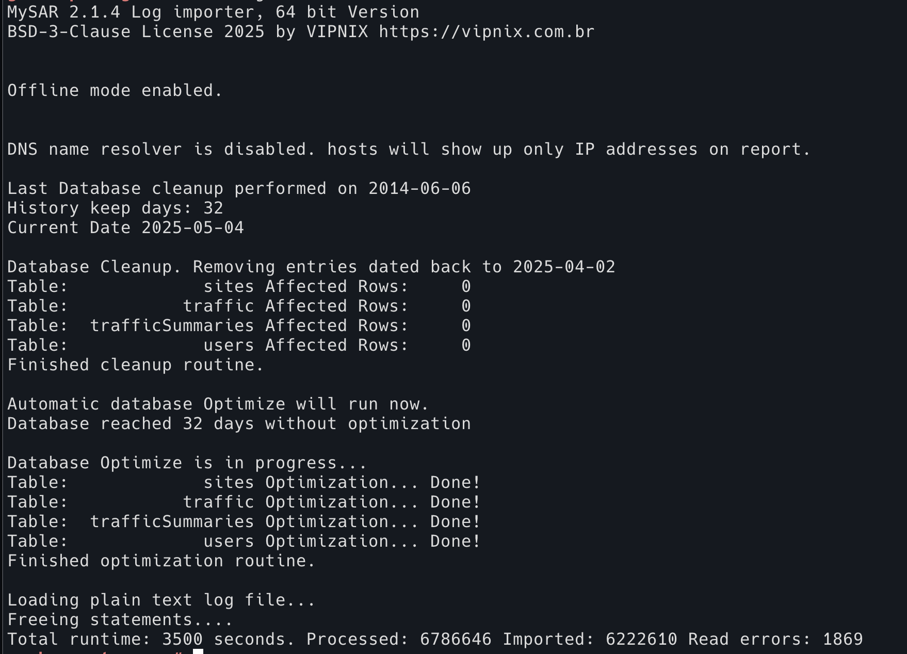
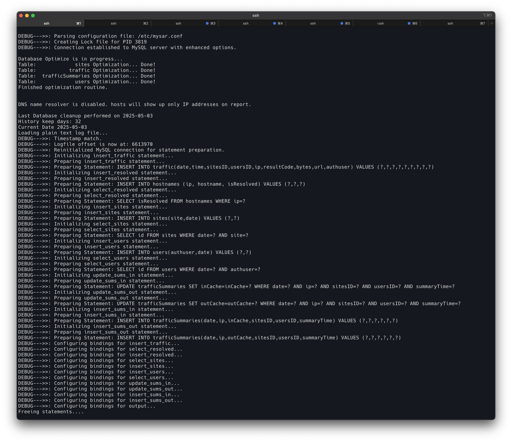

# mysar-ng

Relatório de Acesso Squid com MySQL (nova geração)




 



**Manual do MYSAR-ng**

**Requisitos:**

```
PHP 8.2
Apache ou Nginx
MariaDB 10.11.x ou superior
libmariadb-devel
glibc-2.38
GCC 13.3.1
```

**Instalação:**

**1 - Instalar no APACHE:**

**1.1 - Clonar o repositório:**

```
cd /opt ; git clone https://github.com/coffnix/mysar-ng.git
mv /opt/mysar-ng/mysar /var/www/html/
```

**1.2 - Copiar o arquivo para a pasta de configuração do apache:**

```
cp /var/www/html/mysar/etc/mysar.apache /etc/httpd/conf.d/mysar.conf
```

**ou configurar manualmente**

**(apache 2.2):**

```
Alias /mysar /var/www/html/mysar/www
<Directory "/var/www/html/mysar/www">
        Options Indexes MultiViews
        Options Indexes FollowSymLinks
        AllowOverride None
        Order allow,deny
        Allow from all
</Directory>
```

**(apache 2.4):**

```
Alias /mysar /var/www/html/mysar/www
<Directory "/var/www/html/mysar/www">
        Options Indexes MultiViews
        Options Indexes FollowSymLinks
        AllowOverride None
        Require all granted
</Directory>
```

**1.3 - Reiniciar apache:**

```
systemctl restart httpd
```

**2 - Instalar no MYSQL:**

**2.1 - Criar usuário e banco de dados:**

```
mysql> create database mysar;
mysql> grant all privileges on mysar.* to mysar@'localhost' identified by 'mysar123';
mysql> flush privileges;
```

**2.2 - Importar banco de dados padrão:**

```
mysql mysar < /opt/mysar-ng/mysar.sql
```

**3 - Compilar o importador binário**

```
cd /var/www/html/mysar/bin/mysar-binary-importer/ ; make clean ; CPPFLAGS="-I/usr/include/mariadb" LDFLAGS="-L/usr/lib64" ./configure --prefix=/usr --sysconfdir=/etc --with-mysql-lib=/usr/lib64 --with-mysql-include=/usr/include/mariadb ; make ; make install
```

**4 - Configurar crontab**

```
* * * * *      root    /usr/bin/mysar > /var/www/html/mysar/log/mysar-importer.log 2>&1
01 00 * * * root /var/www/html/mysar/bin/mysar-rotate-diario.sh
```

**Boas práticas**

**Desativar logs cache\_object no SQUID:**

```
acl manager proto cache_object
acl localhost src 127.0.0.1/32

log_access deny manager
http_access allow manager localhost
```

**Dicas de ouro:**
Após importar um volume grande de dados, como logs com mais de 32 dias, pode ocorrer de a limpeza só ser realizada um dia depois por design do código. Em suma: A função MySAR_db_cleanup() na versão anterior de database.c verifica if (strcmp(today, config->lastcleanup) != 0)
Para resolver isso, execute:
```
echo "UPDATE mysar.config SET value = '2025-05-03' WHERE name = 'lastCleanUp';" | mysql mysar
```
E tente realizar a limpeza novamente debugando com:
```
mysar -d
```

Mais informações: RTFM \:D

Squid antigo: [http://www.squid-cache.org/Doc/config/log\_access/](http://www.squid-cache.org/Doc/config/log_access/)

Squid novo: [http://www.squid-cache.org/Doc/config/access\_log/](http://www.squid-cache.org/Doc/config/access_log/)

## Opções de Linha de Comando Disponíveis

Abaixo estão os parâmetros que podem ser utilizados ao executar o importador binário do MySAR-ng (`mysar`), com explicações técnicas sobre seu comportamento:

- `--resolver`  
  Ativa o resolvedor DNS durante a importação. Útil para popular automaticamente domínios a partir de IPs.

- `--noresolver`  
  Desativa o resolvedor DNS (padrão). Nenhuma resolução de IP para nome será realizada.

- `--traffic`  
  Ativa a importação completa do tráfego de navegação a partir do log (padrão). Inclui URLs acessadas e seus respectivos domínios.

- `--notraffic`  
  Desativa a importação completa de tráfego. Detalhes de navegação não serão importados (apenas dados brutos).

- `--zip <arquivo>`  
  Importa um arquivo compactado (`.gz`) em modo offline. O modo offline não depende do deslocamento do log atual.

- `--logfile <arquivo>`  
  Importa um arquivo de log de texto plano em modo offline, ideal para logs antigos ou backups.

- `--debug`  
  Ativa funcionalidades de depuração. Exibe mensagens detalhadas úteis para diagnosticar problemas obscuros durante o parsing ou inserção.

- `--config <arquivo>`  
  Define um arquivo de configuração alternativo ao padrão (`/etc/mysar.conf`).

- `--help`  
  Mostra a ajuda com todas as opções de linha de comando disponíveis.

- `--generatedb`  
  Executa o gerador de banco de dados. Cria ou substitui as tabelas utilizadas pelo MySAR.

- `--stats`  
  Exibe o status dos registros processados durante a importação (ex.: quantidade de linhas, inserções, descartes).

- `--optimizedb`  
  Força a execução do otimizador de banco de dados. Reorganiza índices e melhora performance em grandes volumes de dados.

- `--groupdomains`  
  Agrupa domínios semelhantes na visualização de sites. Melhora a precisão do tráfego, mas pode reduzir a performance.

- `--offline`  
  Modo de importação offline. Necessita de `--logfile` ou `--zip`. Ignora o offset salvo, útil para logs antigos.

- `--quiet`  
  Executa em modo silencioso. Nenhuma mensagem será mostrada no terminal. Erros são redirecionados para o `syslog`.

- `--kill`  
  Envia um sinal de encerramento ao importador binário em execução. Ele será finalizado de forma segura.


## Changelog: MySAR-NG (6f79a578..b29c38b7) - Setembro de 2023 a Maio de 2025

Alinhamento da Função MySAR\_import\_sites com o Código Antigo
Arquivo: src/sql.c
Mudança: A função MySAR\_import\_sites foi revisada para remover validações rigorosas de record.site e record.date, restaurando o comportamento do código original (pré-2023), que permitia inserções sem verificações de strings vazias ou datas inválidas.

Remoção do Filtro NONE\_NONE
Arquivo: src/mysar.c
Mudança: Eliminado o filtro que descartava linhas do log com NONE\_NONE no campo resultCode (mws\[3]).

Melhoria no Fallback de record.site
Arquivo: src/mysar.c
Mudança: Aprimorada a lógica de geração de record.site para URLs atípicas, inspirada no código antigo.

Sanitização Mínima de URLs
Arquivo: src/mysar.c
Mudança: Reduzida a sanitização de URLs para substituir apenas espaços e tabulações.

Depuração Aprimorada
Arquivos: src/mysar.c, src/sql.c
Mudança: Adicionada depuração detalhada para rastrear descartes e inserções.

Correção de Configurações de Offset
Arquivo: Banco de dados (config table)
Mudança: Zerar lastLogOffset e lastTimestamp para evitar descartes por carimbos de tempo antigos.

Manutenção da Validação de Carimbos de Tempo
Arquivo: src/mysar.c
Mudança: Mantida a validação de time\_tm\_cycle e record.date para evitar datas inválidas (0000-00-00).

Tratamento de URLs Longas (Split Tokens Underflow)
Arquivo: src/mysar.c
Mudança: Mantida a lógica de descarte para 68 linhas com menos de 10 tokens, mas com depuração para análise futura.

Compatibilidade com MariaDB 10.11
Arquivo: Nenhum (configuração de compilação)
Mudança: Ajustes na configuração de compilação para suportar MariaDB 10.11.9.

Documentação Implícita
Arquivo: Nenhum (práticas de desenvolvimento)
Mudança: Adição de comentários e logs no código para documentar mudanças, inspirados em práticas de kernel.

Resumo
As mudanças de 2023 a 2025 transformaram o MySAR-NG de um estado com importação incompleta (21.986 registros) para uma solução robusta que importa 49.749 de 49.833 registros, alinhando a função MySAR\_import\_sites ao comportamento do código antigo, removendo filtros restritivos como NONE\_NONE, aprimorando o fallback de record.site para URLs atípicas, reduzindo a sanitização de URLs, adicionando depuração detalhada, e corrigindo configurações de offset, tudo isso mantendo compatibilidade com MariaDB 10.11 e garantindo que a tabela sites seja populada corretamente para uso na interface web.

